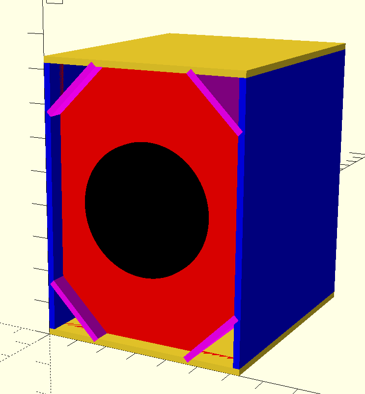
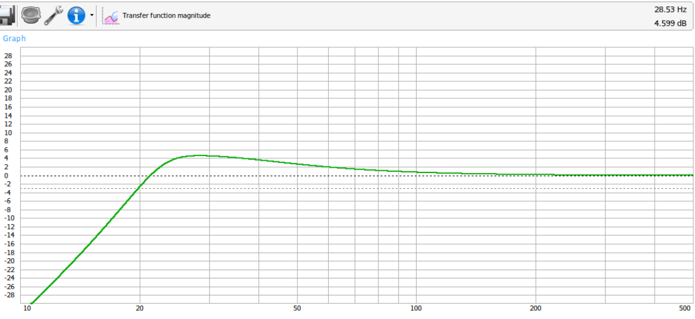
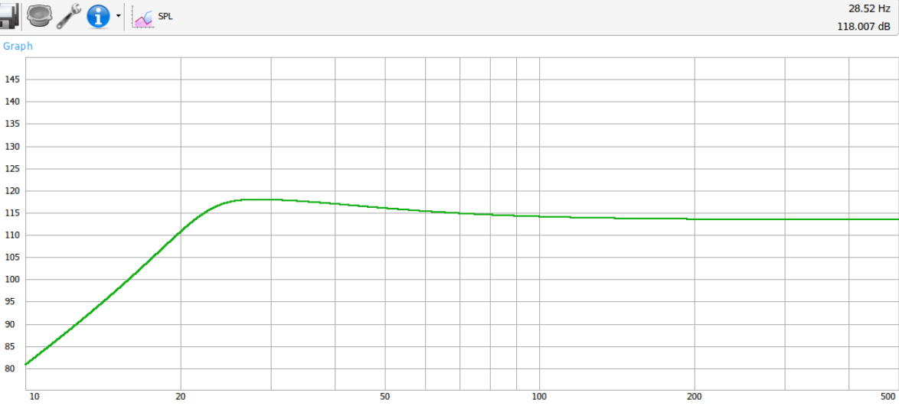
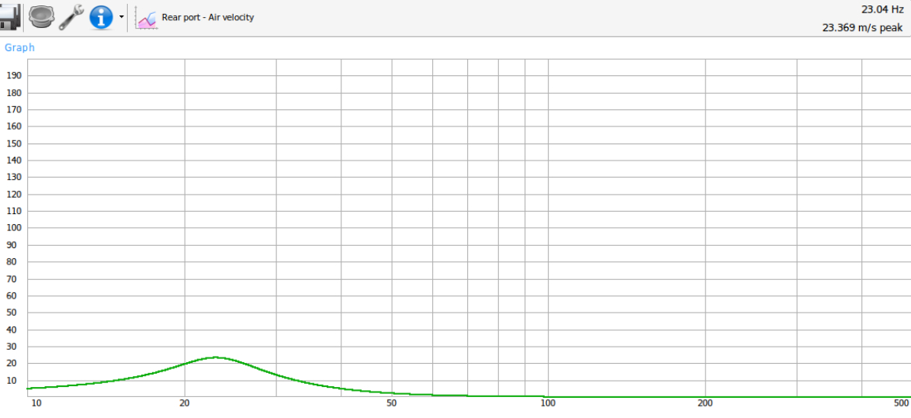
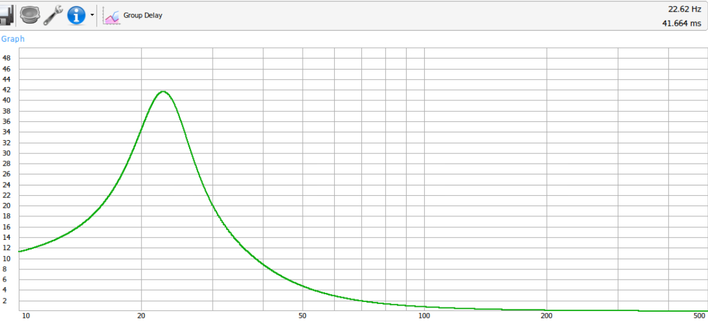
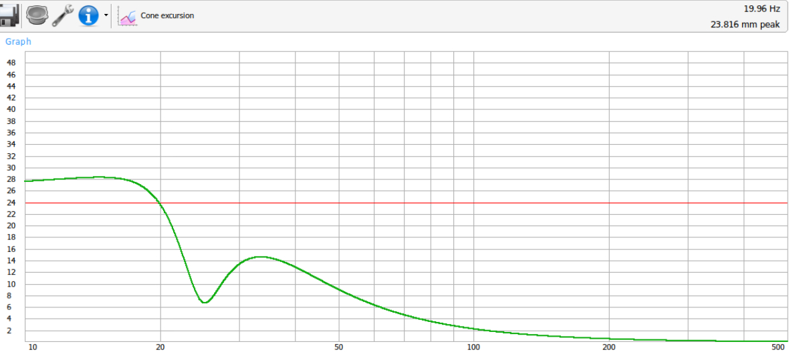

## Subwoofer Enclosure Design

Enclosure design for Dayton Ultimax 15 UMII15-22

General info for driver:
https://www.daytonaudio.com/product/2065/umii15-22-ultimax-ii-15-dvc-subwoofer-2-ohms-per-coil

Spec sheet for driver:
https://www.daytonaudio.com/images/resources/295-714--dayton-audio-UMII15-22-spec-sheet.pdf

Enclosure design is based on modelling in WinISD.

Overall box dimensions using 19mm ply/mdf is:
* 628mm wide
* 748mm deep
* 838mm tall

3D model of the enclosure can be viewed at [ultimax_15_vented_4_triangles.stl](ultimax_15_vented_4_triangles.stl)

OpenSCAD code for generating the model of the enclosure is in [ultimax_15_vented_4_triangles.scad](ultimax_15_vented_4_triangles.scad)

## Panel sizes

* Port panels x4: 443 x 217.605 - should be 179.605 wide on short side of bevel
* Bottom: 748 x 628
* Top: 748 x 628
* Side: 800 x 748
* Side: 800 x 748
* Front: 800 x 590
* Sub cutout diameter: 354
* Back: 800 x 590

Port panels should be cut with 45 degree bevel so the wide side of the piece is
217.6mm wide and the narrow side of the piece is 179.6mm wide. All ports are
443mm long.

Front panel is set back 50mm from the front to allow for a grill.

Extra bracing will help the stiffness of back, side, top, bottom panels.

Box air volume (not including ports, speaker): approx 302.093 litres

## Modelling

Using WinISD

Setup:

* 1 Driver
* Vented enclosure

Parameters:

* 300L box volume
* 25Hz port tuning
* 4 ports, square cross section, 9cm x 9cm (converted to equivalent triangles in this enclosure)
* 600W input signal

Metrics:

* Enclosure gain: 4.6 dB at 28.5 Hz
* -3db from peak of 4.6 dB at 22.29 Hz
* -3db at 19.89 Hz
* Peak SPL at 600W: 118 dB at 28.3 Hz
* Peak port air velocity: 23 m/s at 23 Hz
* Maximum cone excursion at 600W: 19.89 Hz

## Charts

Results from modelling in WinISD

